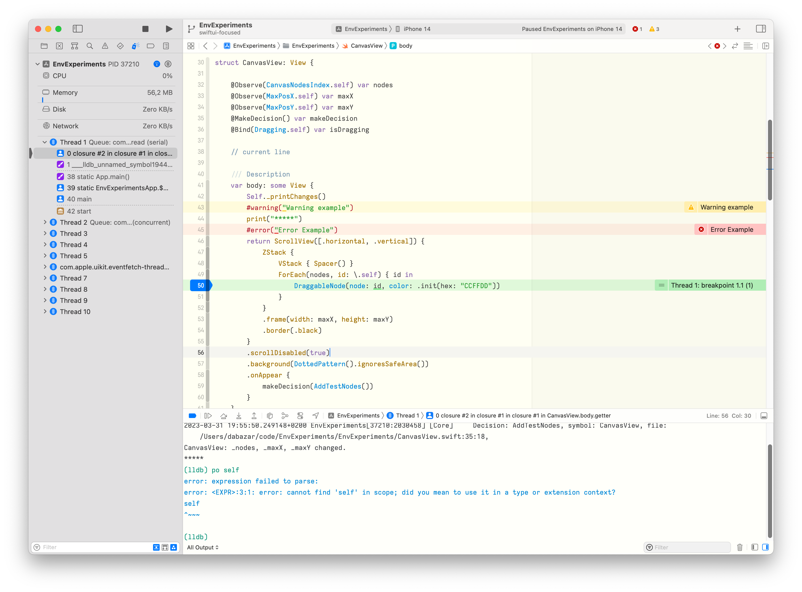

# Sane Xcode Themes 

Simple, sleek themes that deliver essential information without the visual clutter. Less is more!

*Themes:*
- [Sane Dark](#sane-dark-zed)
- [Sane Light](#sane-light-zed)


[Setup](#setup)

## Sane:

themes that utilize the [Zed Extended opensource font](https://github.com/zed-industries/zed-fonts). 
Although it's designed with the Zed font in mind, the themes' aesthetics should work with your preferred font, ensuring a visually pleasing coding experience.

### Sane Dark (Zed)


### Sane Light (Zed)


## Setup

### Manual

Copy the content of `themes` forlder to your `~/Library/Developer/Xcode/UserData/FontAndColorThemes/`

### SH Script
```sh
mkdir ~/Library/Developer/Xcode/UserData/FontAndColorThemes/
git clone git@github.com:MaximBazarov/sane-xcode-themes.git sane-tmp
cp sane-tmp/themes/* ~/Library/Developer/Xcode/UserData/FontAndColorThemes/
rm -rf sane-tmp
```

Reopen Xcode and select the theme you like

